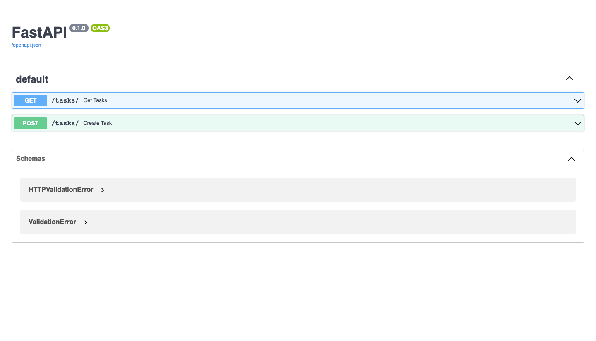

# Creando apis con Fast-Api 

## crear entorno virtual 
```bash
python3 -m venv venv
```
## activar entorno virtual  en mac 
```bash
source venv/bin/activate
```
## activar entorno virtual  en windows 
```bash
venv/Scripts/activate
```

## instalar fast api  
```bash
pip install fastapi
```
## tambien es necesario instalar uvicorn
```bash
pip install uvicorn
```

## para correr la aplicación de fastapi 
```bash
uvicorn main:app --reload
```

## para ver la documentación de la api que vamos creando 
```bash
http://127.0.0.1:8000/docs
```
o la ruta que tengas corriendo 
obtendras esto: 
